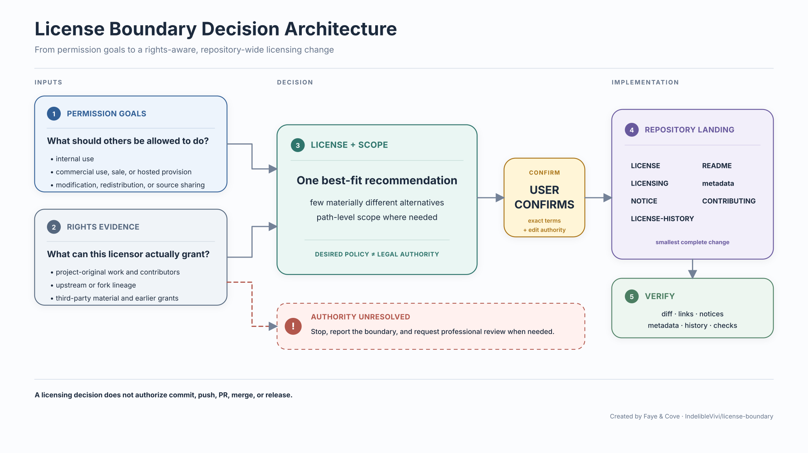

# License Boundary

**English** | [简体中文](README.zh-CN.md)

Practical repository licensing without the vocabulary tax.

License Boundary is a small Codex skill for individual maintainers who need to
choose, audit, add, or change repository licensing without learning license
vocabulary first.

It starts from practical outcomes—who may use the project internally, sell
copies, charge for hosting, modify it, or redistribute it—then checks what the
current rights holder can actually license. It leads with one best-fit
recommendation, offers only materially different alternatives, and leaves the
exact license and scope to the user.

Created by Faye & Cove.

## Install

Ask Codex:

```text
Use $skill-installer to install skills/license-boundary from
IndelibleVivi/license-boundary at v0.1.0.
```

Or use the system installer directly:

```bash
python3 "${CODEX_HOME:-$HOME/.codex}/skills/.system/skill-installer/scripts/install-skill-from-github.py" \
  --repo IndelibleVivi/license-boundary \
  --path skills/license-boundary \
  --ref v0.1.0
```

The installed skill is available to Codex on the next turn. The installer
refuses to overwrite an existing skill directory.

The distributed skill folder includes the complete SUL-1.0 terms in
`LICENSE.txt` and the project notice in `NOTICE.md`; recipients do not need the
repository root to identify the terms and attribution governing the functional
package.

## How it works



Permission goals, licensing authority, final user selection, repository-wide
implementation, and verification remain separate boundaries.

[Architecture notes and editable source](docs/architecture/) ·
[中文架构说明](docs/architecture/README.zh-CN.md) ·
[中文横版图](docs/architecture/license-boundary-decision-flow.zh-CN.svg)

## What it helps with

- choosing between permissive open source, copyleft, source-available, layered
  licensing, or no public grant;
- explaining commercial use, resale, hosted provision, modification,
  redistribution, attribution, and source-sharing consequences in plain
  language;
- separating code, documentation, diagrams, data, trademarks, and third-party
  material when one repository-wide license would be misleading;
- checking upstream, derivative, contributor, and ownership boundaries before
  making a rights claim;
- applying the selected terms consistently across license files, path maps,
  README language, package metadata, contribution terms, and notices; and
- preserving earlier public grants during a forward-only license change.

The skill may clarify a boundary that changes the answer, but it should not
turn a straightforward choice into a questionnaire. The user confirms the
final license and scope before public legal terms are written.

## Example requests

```text
Which license fits if people may modify this tool but may not sell it or offer
it as a paid hosted service?
```

```text
Audit this repository before I replace MIT. Keep earlier MIT copies valid and
tell me whether contributors or upstream code limit what I can relicense.
```

```text
License the software under Apache-2.0 and the handbook and diagrams under
CC BY-SA 4.0. Update every affected repository surface after I confirm.
```

## Boundaries

License Boundary supports repository licensing hygiene; it is not
individualized legal advice. It stops for professional review when a result
depends on disputed ownership, employment or assignment terms, a difficult
copyleft derivative-work question, commercially material interpretation of
NonCommercial language, patent exposure, or a negotiated exception.

This repository is the canonical source and official release channel for the
`license-boundary` Codex skill. Faye-maintained companion projects may
recommend a tested release, but do not bundle or auto-update a same-named copy.
The project treats only unmodified tagged releases from this repository as
official License Boundary releases.

Third-party redistribution of SUL-covered functional materials remains
governed by SUL-1.0, including its noncommercial distribution,
notice-preservation, and modified-copy requirements. Documentation and other
separately mapped paths remain governed by the licenses identified in
[LICENSING.md](LICENSING.md). A compliant redistribution does not become an
official project release merely because the applicable public license permits
it.

License Boundary works well alongside Softpowers: Softpowers handles general
repository engineering methods, while this specialist owns licensing choices,
rights lineage, and forward-only relicensing boundaries. Install and upgrade
the two products independently.

## Licensing

This repository and the distributed Skill are source-available, not OSI open
source. These project licenses govern License Boundary itself; they do not
determine the license of repositories analyzed or changed with the Skill.

Project-original functional materials are licensed under SUL-1.0. In practical
terms, you may install, use, copy, and modify the functional package for
personal, noncommercial, or internal business purposes. You may redistribute
it free of charge for noncommercial purposes. Required license, copyright, and
attribution notices must remain visible, and modified copies must be marked.

Selling the Skill, paid redistribution, commercial white-label provision, or
otherwise providing the covered functional materials to others for commercial
purposes is outside the public grant and requires separate permission.

Project-original README and other documentation are licensed under CC
BY-NC-SA 4.0, which permits noncommercial sharing and adaptation with
attribution and ShareAlike.

See [LICENSING.md](LICENSING.md) for the authoritative path map,
[LICENSE](LICENSE) for the SUL-1.0 terms,
[LICENSE-DOCUMENTATION.md](LICENSE-DOCUMENTATION.md) for the documentation
license, and [NOTICE.md](NOTICE.md) for project attribution.
