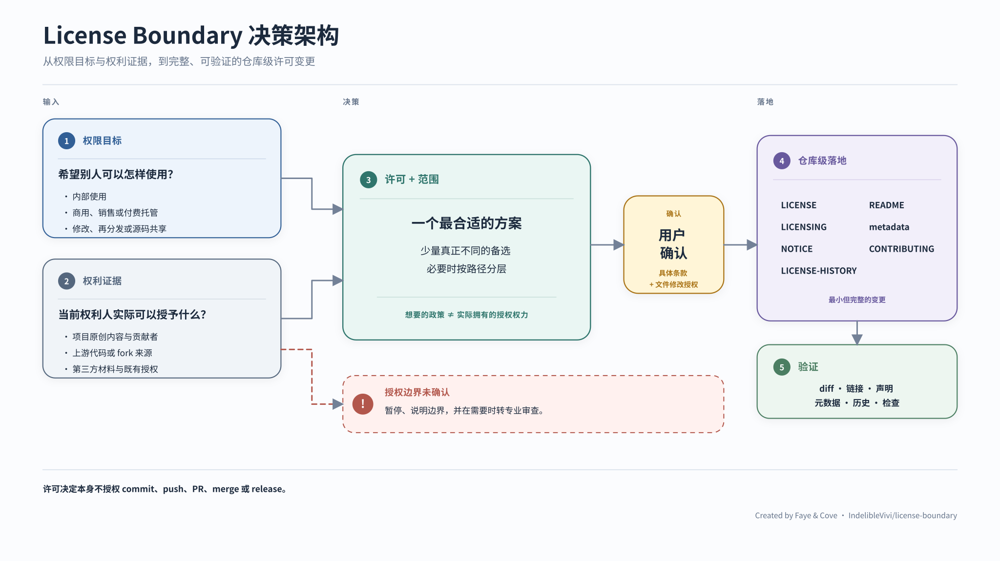

# License Boundary

[English](README.md) | **简体中文**

实用的 repository licensing，不收术语税。

License Boundary 是一个小而专的 Codex skill，给需要选择、audit、添加或变更
repo license 的个人 maintainer。你不必先学完一整套 licensing 词汇，才能把
授权边界做对。

它从实际结果出发——谁可以在内部使用项目、出售副本、收费提供托管服务、
修改或再分发——再检查当前权利人究竟有权许可什么。它会先给出一个最合适的
建议，只提供真正有差异的备选，并把最终 license 与适用范围留给用户确认。

Created by Faye & Cove.

## 安装

直接告诉 Codex：

```text
使用 $skill-installer，从 IndelibleVivi/license-boundary 的 v0.1.0 安装
skills/license-boundary。
```

也可以直接运行 system installer：

```bash
python3 "${CODEX_HOME:-$HOME/.codex}/skills/.system/skill-installer/scripts/install-skill-from-github.py" \
  --repo IndelibleVivi/license-boundary \
  --path skills/license-boundary \
  --ref v0.1.0
```

安装后，下一轮 Codex 对话即可使用这个 skill。Installer 不会覆盖已经存在的
skill directory。

分发的 skill folder 已包含完整的 SUL-1.0 条款 `LICENSE.txt` 和项目
notice `NOTICE.md`；接收者不需要回到 repository root，也能识别 functional
package 适用的条款与 attribution。

## 它如何工作



许可目标、授权权利基础、用户最终选择、repo-wide implementation 与 verification
始终是彼此独立的边界。

[中文架构说明与可编辑 source](docs/architecture/README.zh-CN.md) ·
[English architecture notes](docs/architecture/) ·
[English landscape](docs/architecture/license-boundary-decision-flow.svg)

## 它能帮你处理什么

- 在 permissive open source、copyleft、source-available、layered
  licensing 与不作公开许可之间选择；
- 用平实语言解释 commercial use、resale、hosted provision、modification、
  redistribution、attribution 与 source-sharing 的实际后果；
- 当一个 repo-wide license 会产生误导时，分别处理 code、documentation、
  diagrams、data、trademarks 与 third-party material；
- 在作出权利声明前，检查 upstream、derivative、contributor 与 ownership
  边界；
- 把确认后的条款一致地落到 license files、path maps、README、package
  metadata、contribution terms 与 notices；以及
- 在 forward-only license change 中保留此前已经授予的公开许可。

Skill 可以追问一个会改变答案的关键边界，但不会把原本直接的选择变成一份
问卷。用户确认最终 license 与 scope 之后，才会写入公开法律条款。

## 示例请求

```text
如果别人可以修改这个工具，但不能出售它，也不能把它作为收费托管服务提供，
哪一种 license 最合适？
```

```text
我准备替换这个 repo 的 MIT license。先 audit 一遍：保留此前 MIT 版本的效力，
并告诉我 contributor 或 upstream code 会不会限制我现在的 relicensing。
```

```text
软件使用 Apache-2.0，handbook 和 diagrams 使用 CC BY-SA 4.0。
我确认后，请更新 repo 里所有受影响的 surface。
```

## 边界

License Boundary 用于 repository licensing hygiene，不构成针对具体个案的法律
意见。当答案取决于有争议的 ownership、employment 或 assignment 条款、复杂的
copyleft derivative-work 判断、具有商业实质的 NonCommercial 解释、patent
exposure 或 negotiated exception 时，它会停下来建议 professional review。

本 repository 是 `license-boundary` Codex skill 的 canonical source 与
official release channel。Faye 维护的 companion projects 可以推荐经过测试的
release，但不会捆绑或自动更新同名副本。项目只把来自本 repository、未经修改的
tagged releases 认作 official License Boundary releases。

第三方再分发适用 SUL-1.0 的 functional materials 时，仍须遵守 SUL-1.0，包括
非商业分发、保留 notice，以及标明修改后的副本。
Documentation 和其他单独映射的路径，适用 [`LICENSING.md`](LICENSING.md)
标明的 license。即使某次再分发符合相应 public license，也不会因此自动成为
official project release。

License Boundary 与 Softpowers 很适合并用：Softpowers 负责通用的 repository
engineering methods；这个 specialist 则负责 licensing choice、rights lineage
与 forward-only relicensing boundaries。两者应独立安装、独立升级。

## 本项目如何授权

本 repository 与分发的 Skill 是 source-available，不是 OSI open source。
这些项目 license 只管理 License Boundary 自身，不决定被它分析或修改的其他
repository 应使用什么 license。

项目原创的 functional materials 适用 SUL-1.0。就实际效果而言，你可以为个人、
非商业或内部商业目的安装、使用、复制与修改 functional package，也可以免费且
非商业地再分发；必须保留要求的 license、copyright 与 attribution notices，
修改后的副本还需要标明修改。

出售本 Skill、收费再分发、commercial white-label provision，或以其他商业方式
向他人提供受保护的 functional materials，不在 public grant 范围内，需要另行
取得许可。

项目原创的 README 与其他 documentation 适用 CC BY-NC-SA 4.0，允许在
attribution、NonCommercial 与 ShareAlike 条件下分享和改编。

本页是项目说明的中文版本，不翻译、替代或修改 governing legal terms。具体路径
适用哪一种 license，以 [`LICENSING.md`](LICENSING.md) 为准；完整条款见
[`LICENSE`](LICENSE) 与
[`LICENSE-DOCUMENTATION.md`](LICENSE-DOCUMENTATION.md)，项目 attribution
见 [`NOTICE.md`](NOTICE.md)。
